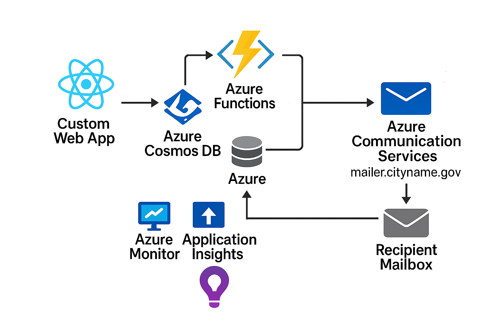

<div align="center">

# CouncilConnect Municipal Email System

Modern, multi-tenant email outreach & constituent list management for ward / district councilors.

Built with React 19, TypeScript, Tailwind CSS 4, Radix UI, GitHub Spark KV storage, Azure Cosmos DB, and Azure Communication Services.

</div>

---

## 📘 Overview
CouncilConnect streamlines how elected council representatives compose and send targeted email communications to their constituents. It provides an opinionated UI for drafting messages, managing distribution lists, honoring unsubscribe preferences, and viewing lightweight campaign analytics — all while isolating each councilor's data via subdomain-based multi-tenancy, persisting operational data in Azure Cosmos DB, and dispatching campaigns through Azure Communication Services (ACS).

## 🏗 Architecture
High-level architecture (React front end + Spark runtime + Azure Functions backend + managed services):



### Key Concepts
- **Multi-Tenant Isolation**: Every councilor is identified by subdomain (e.g. `ward1.example.com`). All persisted keys are automatically namespaced via `getCouncilorKey()`.
- **Persistent KV Storage**: GitHub Spark `useKV` hook provides reactive, auto-persisted state — no manual saves.
- **Cosmos DB Data Hub**: Campaigns, contacts, unsubscribe lists, and analytics events flow to Azure Cosmos DB via the Python Azure Functions APIs, enabling durable storage and cross-tab synchronization.
- **ACS Email Delivery**: Outbound emails are sent through Azure Communication Services with batching, diagnostics, and delivery status persisted back to Cosmos DB.
- **Email Lifecycle**: Draft → (apply unsubscribe filtering at send time) → Sent archive with metrics placeholders.
- **UI Tabs**: Compose | Contact Lists | Analytics | Settings.

## ✨ Features
- Rich email composer (basic formatting + saved drafts)
- Distribution list CRUD with duplicate + CSV import safeguards
- Unsubscribe management (filtering at send time)
- Azure Cosmos DB-backed persistence for drafts, contacts, unsubscribes, and campaign telemetry
- Azure Communication Services email pipeline with batched dispatch, diagnostics, and result tracking
- Mock analytics dashboard (delivery / open / click placeholders)
- Councilor profile & signature settings
- Accessible component system (Radix + Tailwind + shadcn-style wrappers)
- Toast notifications (Sonner)

## 🛠 Tech Stack
| Layer | Tools |
|-------|-------|
| UI | React 19, Radix UI primitives, Tailwind CSS 4 |
| State & Persistence | GitHub Spark `useKV` (KV storage), Azure Cosmos DB |
| Backend & Integrations | Azure Functions (Python), Azure Communication Services Email |
| Forms & Validation | React Hook Form + Zod |
| Feedback | Sonner toasts, Error Boundary |
| Visualization | Recharts, D3 (select components) |
| Utilities | TypeScript, clsx, class-variance-authority |

## 📂 Directory Guide (Selective)
```
src/
	App.tsx                # Root layout & tab shell
	components/
		email/EmailComposer.tsx
		lists/DistributionLists.tsx
		analytics/Analytics.tsx
		settings/Settings.tsx
		ui/*                 # Reusable UI primitives (shadcn-style)
	backend/
		email_functionapp.py # Azure Functions entrypoint orchestrating Cosmos DB + ACS email workflows
		documentation/
			councilconnect-arch.png
	hooks/
		use-mobile.ts        # Responsive hook
	lib/utils.ts           # Shared utility helpers (cn, etc.)
```

## 🔐 Multi-Tenancy & Data Model
All persisted collections use `getCouncilorKey(baseKey)` to ensure isolation. Example pattern:
```ts
const [drafts, setDrafts] = useKV<Email[]>(getCouncilorKey('email-drafts'), [])
```
The Azure Functions backend mirrors these entities in Azure Cosmos DB, using the same councilor scoped identifiers to keep the UI and server state in sync across sessions and devices.
Primary keys:
- `email-drafts`: `Email[]` (status: draft | sent, timestamps)
- `distribution-lists`: `DistributionList[]`
- `unsubscribed-emails`: `string[]`
- `user-profile`: `UserProfile`

Unsubscribe filtering is applied only when sending (original lists remain intact).

## 🚀 Getting Started (Local Development)
### Prerequisites
- Node.js 20+ (LTS recommended)
- npm 10+
- Python 3.11+, Azure Functions Core Tools v4 (for the Azure Functions backend)
- Azure Cosmos DB account or emulator, plus Azure Communication Services email resource (or ACS connection string)

### 1. Install Dependencies
```bash
npm install
```

### 2. Start Dev Server
```bash
npm run dev
```
Open the printed local URL (default: http://localhost:5173).

### Backend Azure Functions API (Cosmos DB + ACS)
The Python Azure Functions project powers durable persistence in Azure Cosmos DB and orchestrates campaign dispatch via Azure Communication Services. Run it locally whenever you need the full end-to-end experience (saving to Cosmos, sending through ACS, populating analytics).

#### Backend Prerequisites
```bash
python -m venv .venv
. ./.venv/Scripts/Activate.ps1   # PowerShell (Windows)
pip install -r requirements.txt
```
Install Azure Functions Core Tools if you have not already (see Microsoft docs).

#### Quick Start (Manual)
```bash
cd src/backend
func start
```

#### Preferred: Helper Script
A convenience script `scripts/run-functions.ps1` activates the virtualenv and starts the Functions host (optionally launching Azurite).

Examples:
```pwsh
# Basic start (expects existing .venv and installed requirements)
./scripts/run-functions.ps1

# Start plus Azurite storage emulator in background
./scripts/run-functions.ps1 -WithAzurite

# Re-install Python deps first
./scripts/run-functions.ps1 -InstallRequirements

# Custom port
./scripts/run-functions.ps1 -Port 8081

# Combine flags
./scripts/run-functions.ps1 -WithAzurite -InstallRequirements -Port 8081
```

Flags:
- `-WithAzurite` launches `npm run azurite` as a background job.
- `-InstallRequirements` runs `pip install -r requirements.txt` before starting.
- `-Port <number>` sets host port (default 7071).
- `-FunctionsDir <path>` override backend directory (default `src/backend`).
- `-Quiet` suppresses informational logging.

Set the Cosmos DB connection details (`COSMOS_ENDPOINT`, `COSMOS_KEY`, `COSMOS_DB_NAME`, and optionally `COSMOS_ONE_CONTAINER_NAME` for dev) plus ACS email settings (`ACS_CONNECTION_STRING`, `EMAIL_SENDER`, and `ENABLE_EMAIL_SEND`) in `src/backend/local.settings.json` or your environment before starting the host.

Once running, the Functions host will expose endpoints under `http://localhost:<port>/api/` (e.g. `/api/openapi.json`, `/api/docs`).

### 3. Build Production Bundle
```bash
npm run build
```
Artifacts are generated in `dist/`.

### 4. Preview Production Build
```bash
npm run preview
```

### 5. Lint
```bash
npm run lint
```

### Deterministic CI Install
```bash
npm ci
```

## 🧪 Common Scripts
| Script | Purpose |
|--------|---------|
| `dev` | Run Vite dev server |
| `build` | Type check (tsc --noCheck skip emit) + bundle |
| `preview` | Serve built `dist/` locally |
| `lint` | ESLint over repo |
| `optimize` | Pre-optimize Vite deps |

## 🧩 Extending
Add new persisted feature data by:
1. Defining a TypeScript interface
2. Adding a `useKV<Type>(getCouncilorKey('your-key'), defaultValue)` hook
3. Creating a focused component under `src/components/<feature>/`
4. Using shared UI primitives from `components/ui` for consistency

## ♿ Accessibility
Radix UI primitives + Tailwind ensure keyboard & screen reader friendly controls. Maintain semantic markup and label associations when adding new inputs.

## � Troubleshooting
| Issue | Fix |
|-------|-----|
| Blank page | Check console for runtime error; ErrorBoundary will fallback |
| Styles missing | Ensure dev server running; Tailwind rebuilds on save |
| Wrong Node version | Use `nvm use 20` or configure Volta |
| Port conflict | `npm run dev -- --port 5174` |

## 🔒 Unsubscribe Handling
Unsubscribed emails are never removed from lists; they are dynamically excluded when sending to preserve historical targeting integrity.

## 🗺 Roadmap (Potential)
- Additional email provider integrations (SendGrid/MailJet)
- Advanced analytics ingestion
- Role-based admin dashboard
- CSV export of campaign metrics

## 📜 License
Project code released under MIT. Portions of the initial Spark template are (c) GitHub, Inc., MIT License.

---

> Need help extending or deploying? Open an issue or start a discussion.

