<div align="center">

# CouncilConnect Municipal Email System

Modern, multi-tenant email outreach & constituent list management for ward / district councilors.

Built with React 19, TypeScript, Tailwind CSS 4, Radix UI, GitHub Spark KV storage, Azure Cosmos DB, and Azure Communication Services.

</div>

---

## 📘 Overview
CouncilConnect streamlines how elected council representatives compose and send targeted email communications to their constituents. It provides an opinionated UI for drafting messages, managing distribution lists, honoring unsubscribe preferences, and viewing lightweight campaign analytics — all while isolating each councilor's data via subdomain-based multi-tenancy, persisting operational data in Azure Cosmos DB, and dispatching campaigns through Azure Communication Services (ACS).

## 🏗 Architecture
High-level architecture (React front end + Spark runtime + Azure Functions backend + managed services):


### Key Concepts
- **Multi-Tenant Isolation**: Every councilor is identified by subdomain (e.g. `ward1.example.com`). All persisted keys are automatically namespaced via `getCouncilorKey()`.
- **Persistent KV Storage**: GitHub Spark `useKV` hook provides reactive, auto-persisted state — no manual saves.
- **Cosmos DB Data Hub**: Campaigns, contacts, unsubscribe lists, and analytics events flow to Azure Cosmos DB via the Python Azure Functions APIs, enabling durable storage and cross-tab synchronization.
- **ACS Email Delivery**: Outbound emails are sent through Azure Communication Services with batching, diagnostics, and delivery status persisted back to Cosmos DB.
- **Email Lifecycle**: Draft → (apply unsubscribe filtering at send time) → Sent archive with metrics placeholders.
- **UI Tabs**: Compose | Contact Lists | Analytics | Settings.

## ✨ Features
- Rich email composer (basic formatting + saved drafts)
- Distribution list CRUD with duplicate + CSV import safeguards
- Unsubscribe management (filtering at send time)
- Azure Cosmos DB-backed persistence for drafts, contacts, unsubscribes, and campaign telemetry
- Azure Communication Services email pipeline with batched dispatch, diagnostics, and result tracking
- Mock analytics dashboard (delivery / open / click placeholders)
- Councilor profile & signature settings
- Accessible component system (Radix + Tailwind + shadcn-style wrappers)
- Toast notifications (Sonner)

## 🛠 Tech Stack
| Layer | Tools |
|-------|-------|
| UI | React 19, Radix UI primitives, Tailwind CSS 4 |
| State & Persistence | GitHub Spark `useKV` (KV storage), Azure Cosmos DB |
| Backend & Integrations | Azure Functions (Python), Azure Communication Services Email |
| Forms & Validation | React Hook Form + Zod |
| Feedback | Sonner toasts, Error Boundary |
| Visualization | Recharts, D3 (select components) |
| Utilities | TypeScript, clsx, class-variance-authority |

## 📂 Directory Guide (Selective)
```
src/
	App.tsx                # Root layout & tab shell
	components/
		email/EmailComposer.tsx
		lists/DistributionLists.tsx
		analytics/Analytics.tsx
		settings/Settings.tsx
		ui/*                 # Reusable UI primitives (shadcn-style)
	backend/
		email_functionapp.py # Azure Functions entrypoint orchestrating Cosmos DB + ACS email workflows
		documentation/
			councilconnect-arch.png
	hooks/
		use-mobile.ts        # Responsive hook
	lib/utils.ts           # Shared utility helpers (cn, etc.)
```

## 🔐 Multi-Tenancy & Data Model
All persisted collections use `getCouncilorKey(baseKey)` to ensure isolation. Example pattern:
```ts
const [drafts, setDrafts] = useKV<Email[]>(getCouncilorKey('email-drafts'), [])
```
The Azure Functions backend mirrors these entities in Azure Cosmos DB, using the same councilor scoped identifiers to keep the UI and server state in sync across sessions and devices.
Primary keys:
- `email-drafts`: `Email[]` (status: draft | sent, timestamps)
- `distribution-lists`: `DistributionList[]`
- `unsubscribed-emails`: `string[]`
- `user-profile`: `UserProfile`

Unsubscribe filtering is applied only when sending (original lists remain intact).

## 🛡️ Security Architecture

### Authentication Flow
The application implements a comprehensive security model with both frontend and backend authentication:

```
[User] → [Frontend SPA] → [Microsoft Identity] → [Backend API] → [Azure Services]
   ↓           ↓               ↓                    ↓              ↓
Sign-in → PKCE Flow → JWT Token → Token Validation → Managed Identity
```

### Frontend Security
- **Microsoft Authentication Library (MSAL)**: Handles OAuth 2.0/OpenID Connect flows
- **PKCE Flow**: Proof Key for Code Exchange prevents authorization code interception
- **Token Management**: Automatic token refresh and secure storage in sessionStorage
- **Route Protection**: All routes blocked until valid authentication
- **Councillor Isolation**: Data scoped by authenticated user identity

### Backend Security  
- **JWT Validation**: All API requests validate Microsoft-issued access tokens
- **Signature Verification**: Tokens validated against Microsoft JWKS endpoints
- **Claims-Based Authorization**: Councillor/ward identity extracted from token claims
- **Managed Identity**: Azure services accessed without storing secrets
- **Environment-Based Config**: Development bypass mode for local testing

### Data Isolation
- **Multi-Tenant Storage**: Each councillor's data isolated by authenticated identity
- **Scoped KV Keys**: Frontend storage keys prefixed with councillor ID
- **Database Partitioning**: Backend queries filtered by authenticated councillor
- **Ward-Based Groups**: Optional ward-level access control via group claims

## 🔑 Authentication & Authorization
The web app signs users in before showing any municipal data. Sign-in supports both Microsoft Entra ID (work accounts) and Azure AD B2C (community or social accounts). The UI blocks until the token exchange finishes, and every API call includes the access token. Each successful sign-in sets the councillor identifier used by `getCouncillorKey()` for ward data isolation.

### Environment variables
Create a `.env.local` (or populate deployment secrets) with the values that match your deployment environment. You can use the templates in `.env.development` or `.env.production` as starting points.

| Variable | Purpose |
|----------|---------|
| `VITE_API_HOST` | API server hostname (`localhost` for dev, `your-app.azurewebsites.net` for Azure) |
| `VITE_API_PORT` | API server port (`7071` for local Functions, `443` for Azure) |
| `VITE_AUTH_MODE` | `entra`, `b2c`, or `off` (local-only bypass) |
| `VITE_AUTH_CLIENT_ID` | SPA application (client) ID |
| `VITE_AUTH_SCOPES` | Space or comma separated scopes (defaults to `api://<client>/ .default`) |
| `VITE_AUTH_REDIRECT_URI` | Redirect URI registered for the SPA (default: current origin) |
| `VITE_AUTH_POST_LOGOUT_REDIRECT_URI` | Where to land after sign-out |
| `VITE_AUTH_COUNCILLOR_CLAIM` | Claim containing the councillor identifier (default: `extension_councillorId`) |
| `VITE_AUTH_WARD_CLAIM` | Optional ward/group claim name |
| `VITE_AUTH_FALLBACK_COUNCILLOR` | Value used when claims are missing (default: `default-councillor`) |
| `VITE_AUTH_BYPASS` | Set to `true` for temporary local bypass (not for production) |

#### Extra settings for Entra ID tenants
- `VITE_AUTH_TENANT_ID`

#### Extra settings for Azure AD B2C tenants
- `VITE_AUTH_B2C_TENANT` (e.g. `contoso`)
- `VITE_AUTH_B2C_DOMAIN` (e.g. `contoso.b2clogin.com`)
- `VITE_AUTH_B2C_SIGNIN_POLICY` (e.g. `B2C_1_signupsignin`)

### Quick-start scripts for Entra ID
Use `scripts/setup-entra-auth.ps1` to create repeatable app registrations. The script provisions one API registration (with a delegated scope) and one SPA registration, then wires permissions between them.

```pwsh
pwsh ./scripts/setup-entra-auth.ps1 `
	-ProjectName CouncilConnectMunicipal `
	-SpaRedirectUri http://localhost:5173 `
	-SpaLogoutUri http://localhost:5173 `
	-AssignGroupClaims
```

Record the emitted client ID, scope URI, and tenant ID in your `.env.local`. After running it once you can reuse the same IDs in every environment.

### Planning Azure AD B2C
1. Create or reuse a B2C tenant (e.g. `contoso`).
2. Add a user flow or custom policy for sign-up/sign-in (e.g. `B2C_1_signupsignin`).
3. Register a SPA app, enable PKCE, and add the redirect and logout URIs.
4. Register an API app, expose a delegated scope (e.g. `access_as_user`), and grant the SPA permission to call it.
5. Store the tenant name, domain (`contoso.b2clogin.com`), policy name, client ID, and scopes in the environment variables listed above.

When operating alongside Entra ID, you can identify a councillor by group membership, by a custom claim, or by the user object ID. Update `VITE_AUTH_COUNCILLOR_CLAIM` / `VITE_AUTH_WARD_CLAIM` to match the chosen claim so the UI scopes data correctly.

### Backend Authentication Configuration

The API backend requires additional configuration for JWT token validation:

| Variable | Purpose |
|----------|---------|
| `AUTH_BYPASS` | Set to `true` for development, `false` for production |
| `AUTH_TENANT_ID` | Your Entra ID tenant ID |
| `AUTH_CLIENT_ID` | API application (resource) client ID |
| `AUTH_COUNCILLOR_CLAIM` | Token claim containing councillor ID (default: `oid`) |
| `AUTH_WARD_CLAIM` | Token claim containing ward/group ID |
| `AUTH_FALLBACK_COUNCILLOR` | Default councillor ID when claims missing |

**Configuration Templates:**
- `.env.backend.development` - Local development with auth bypass
- `.env.backend.production` - Production settings with real JWT validation

### Security Best Practices

1. **Never commit secrets**: Use `.env` files (gitignored) for all credentials
2. **Enable MFA**: Require multi-factor authentication for councillor accounts
3. **Use Conditional Access**: Restrict sign-in to compliant devices
4. **Rotate Secrets**: Regularly rotate Cosmos DB keys and ACS connection strings
5. **Monitor Access**: Enable Azure AD sign-in logs and Function App diagnostics
6. **Least Privilege**: Grant minimal required permissions to managed identities

## �� Getting Started (Local Development)
### Prerequisites
- Node.js 20+ (LTS recommended)
- npm 10+
- Python 3.11+, Azure Functions Core Tools v4 (for the Azure Functions backend)
- Azure Cosmos DB account or emulator, plus Azure Communication Services email resource (or ACS connection string)

### 0. Configure environment
Copy the appropriate environment template to `.env.local`:

**For local development:**
```bash
cp .env.development .env.local
```

**For production deployment:**
```bash
cp .env.production .env.local
# Then edit .env.local with your actual Azure endpoints and auth settings
```

The development template enables authentication bypass for quick testing. The production template requires you to fill in your Azure Function App URL and Entra ID settings.

### 1. Install Dependencies
```bash
npm install
```

### 2. Start Dev Server
```bash
npm run dev
```
Open the printed local URL (default: http://localhost:5173).

### Backend Azure Functions API (Cosmos DB + ACS)
The Python Azure Functions project powers durable persistence in Azure Cosmos DB and orchestrates campaign dispatch via Azure Communication Services. Run it locally whenever you need the full end-to-end experience (saving to Cosmos, sending through ACS, populating analytics).

#### Backend Prerequisites
```bash
python -m venv .venv
. ./.venv/Scripts/Activate.ps1   # PowerShell (Windows)
pip install -r requirements.txt
```
Install Azure Functions Core Tools if you have not already (see Microsoft docs).

#### Quick Start (Manual)
```bash
cd src/backend
func start
```

#### Preferred: Helper Script
A convenience script `scripts/run-functions.ps1` activates the virtualenv and starts the Functions host (optionally launching Azurite).

Examples:
```pwsh
# Basic start (expects existing .venv and installed requirements)
./scripts/run-functions.ps1

# Start plus Azurite storage emulator in background
./scripts/run-functions.ps1 -WithAzurite

# Re-install Python deps first
./scripts/run-functions.ps1 -InstallRequirements

# Custom port
./scripts/run-functions.ps1 -Port 8081

# Combine flags
./scripts/run-functions.ps1 -WithAzurite -InstallRequirements -Port 8081
```

Flags:
- `-WithAzurite` launches `npm run azurite` as a background job.
- `-InstallRequirements` runs `pip install -r requirements.txt` before starting.
- `-Port <number>` sets host port (default 7071).
- `-FunctionsDir <path>` override backend directory (default `src/backend`).
- `-Quiet` suppresses informational logging.

Configure your backend by copying settings from `.env.backend.development` to your `.env` file:

**Required Backend Settings:**
```bash
# Copy from .env.backend.development template
AUTH_BYPASS=true
COSMOS_ENDPOINT=https://your-cosmosdb.documents.azure.com:443/
COSMOS_KEY=your-cosmos-key
ACS_CONNECTION_STRING=endpoint=https://your-acs.communication.azure.com/;accesskey=your-key
```

Once running, the Functions host will expose endpoints under `http://localhost:<port>/api/` (e.g. `/api/openapi.json`, `/api/docs`).

**Backend Authentication:**
- Development: `AUTH_BYPASS=true` allows legacy header authentication
- Production: `AUTH_BYPASS=false` requires valid JWT tokens from frontend

### 3. Build Production Bundle
```bash
npm run build
```
Artifacts are generated in `dist/`.

### 4. Preview Production Build
```bash
npm run preview
```

### 5. Lint
```bash
npm run lint
```

### Deterministic CI Install
```bash
npm ci
```

## 🧪 Common Scripts
| Script | Purpose |
|--------|---------|
| `dev` | Run Vite dev server |
| `build` | Type check (tsc --noCheck skip emit) + bundle |
| `preview` | Serve built `dist/` locally |
| `lint` | ESLint over repo |
| `optimize` | Pre-optimize Vite deps |

## 🚀 Deployment to Azure

### Frontend Deployment (Azure Static Web Apps)
1. **Build Configuration**: Use `.env.production` template for environment variables
2. **Authentication Setup**: Configure Entra ID redirect URIs for your domain
3. **Environment Variables**: Set in Azure portal under Configuration
4. **API Integration**: Update `VITE_API_HOST` to your Function App URL

### Backend Deployment (Azure Functions)
1. **Managed Identity**: Enable system-assigned managed identity on Function App
2. **RBAC Permissions**: Grant Function App access to Cosmos DB and Key Vault
3. **Environment Variables**: Configure in Function App settings (not in code)
4. **Authentication**: Set `AUTH_BYPASS=false` and configure tenant/client IDs

### Security Deployment Checklist
- [ ] Managed identities enabled for all Azure services
- [ ] Connection strings stored in Key Vault (not environment variables)
- [ ] Entra ID app registrations configured with production URLs
- [ ] Conditional Access policies applied to councillor accounts
- [ ] Azure Monitor alerts configured for authentication failures
- [ ] Function App authentication/authorization enabled (optional additional layer)

## 🧩 Extending
Add new persisted feature data by:
1. Defining a TypeScript interface
2. Adding a `useKV<Type>(getCouncilorKey('your-key'), defaultValue)` hook
3. Creating a focused component under `src/components/<feature>/`
4. Using shared UI primitives from `components/ui` for consistency
5. **Security**: Ensure new API endpoints use `@authenticated_route` decorator

## ♿ Accessibility
Radix UI primitives + Tailwind ensure keyboard & screen reader friendly controls. Maintain semantic markup and label associations when adding new inputs.

## � Troubleshooting
| Issue | Fix |
|-------|-----|
| Blank page | Check console for runtime error; ErrorBoundary will fallback |
| Styles missing | Ensure dev server running; Tailwind rebuilds on save |
| Wrong Node version | Use `nvm use 20` or configure Volta |
| Port conflict | `npm run dev -- --port 5174` |

## � Email Tracking & Unsubscribe Architecture

The system implements a comprehensive email tracking and unsubscribe mechanism following Azure Communication Services best practices. All tracking endpoints are hosted on the Azure Functions API backend, ensuring citizens never need to access the councillor web application.

### 🔄 Email Campaign Flow


### 🎯 Email Open Tracking Flow


### 🚫 Unsubscribe Process Flow

```mermaid
flowchart TB
    %% Email Generation
    subgraph "📧 Email Generation"
        EG1[Campaign Created]
        EG2[Generate Unsubscribe URL<br/>api/unsubscribe?councillorId=X&email=user@example.com&campaignId=Y&contactId=Z]
        EG3[Inject Unsubscribe Link in Footer]
    end

    %% Citizen Journey
    subgraph "👤 Citizen Journey"
        CJ1[Receives Email]
        CJ2[Clicks Unsubscribe Link]
        CJ3[Lands on API Endpoint]
        CJ4[Sees Confirmation Page]
    end

    %% Backend Processing
    subgraph "⚙️ Backend Processing"
        BP1{Valid Parameters?}
        BP2[Extract Email & Councillor ID]
        BP3[Add Email to Unsubscribe List]
        BP4[Record Unsubscribe Event]
        BP5[Return HTML Confirmation]
        BP6[Return Error Page]
    end

    %% Data Updates
    subgraph "💾 Data Storage"
        DS1[(Unsubscribe Lists<br/>by Councillor)]
        DS2[(Engagement Analytics<br/>unsubscribe events)]
        DS3[(Campaign Metrics<br/>updated counts)]
    end

    %% Future Email Filtering
    subgraph "🔍 Future Email Filtering"
        FEF1[New Campaign Created]
        FEF2[Query Unsubscribe Lists]  
        FEF3[Filter Recipients]
        FEF4[Send Only to Subscribed]
    end

    %% Flow connections
    EG1 --> EG2 --> EG3
    EG3 --> CJ1 --> CJ2 --> CJ3
    CJ3 --> BP1
    
    BP1 -->|Yes| BP2 --> BP3 --> BP4 --> BP5 --> CJ4
    BP1 -->|No| BP6 --> CJ4
    
    BP3 --> DS1
    BP4 --> DS2
    BP4 --> DS3
    
    FEF1 --> FEF2 --> DS1
    DS1 --> FEF3 --> FEF4

    style CJ2 fill:#ffcdd2
    style BP3 fill:#c8e6c9
    style DS1 fill:#fff3e0
    style FEF3 fill:#e3f2fd
```



### 🛡️ Security & Compliance Architecture


### 🔄 API Endpoint Reference

#### **Public Endpoints (No Authentication)**

| Method | Endpoint | Purpose | Parameters |
|--------|----------|---------|-----------|
| `GET` | `/api/track/pixel` | Email open tracking | `councillorId`, `campaignId`, `contactId` |
| `GET` | `/api/unsubscribe` | One-click unsubscribe page | `email`, `councillorId`, `campaignId`, `contactId` |
| `POST` | `/api/track/unsubscribe` | Record unsubscribe event | `campaignId`, `contactId` (JSON body) |

#### **Protected Endpoints (JWT Required)**

| Method | Endpoint | Purpose | Scope |
|--------|----------|---------|-------|
| `GET` | `/api/campaigns/{id}/analytics` | Campaign metrics | Councillor-scoped |
| `POST` | `/api/campaigns` | Create campaign | Councillor-scoped |
| `GET` | `/api/unsubscribes` | List unsubscribed emails | Councillor-scoped |

### ✅ Azure Communication Services Best Practices

The implementation follows Microsoft ACS recommendations:

1. **✅ Suppression List Integration**: Automatic filtering of unsubscribed recipients
2. **✅ One-Click Unsubscribe**: Direct GET endpoint with immediate processing  
3. **✅ Engagement Tracking**: Built-in ACS tracking + custom analytics
4. **✅ Transparent Process**: Clear unsubscribe links in email footers
5. **✅ Compliance Headers**: List-Unsubscribe headers for email clients
6. **✅ Delivery Status**: Real-time monitoring of email delivery success/failure
7. **✅ Error Handling**: Graceful fallbacks for delivery failures
8. **✅ Audit Trail**: Complete logging of all email events and unsubscribes

### 🔒 Data Privacy & Retention

- **Unsubscribed emails**: Preserved in suppression lists but excluded from future campaigns
- **Engagement data**: Anonymized analytics with configurable retention periods  
- **Personal data**: Minimal collection, secure storage, user-controlled deletion
- **Cross-border**: Data residency controls via Azure region selection
- **GDPR compliance**: Right to be forgotten via complete data purge APIs

## 🔒 Unsubscribe Handling

Unsubscribed emails are never removed from lists; they are dynamically excluded when sending to preserve historical targeting integrity. All unsubscribe processing occurs on the API backend through public endpoints that do not require authentication, ensuring citizens can easily opt-out without needing access to the councillor web application.

## 🗺 Roadmap (Potential)

- Additional email provider integrations (SendGrid/MailJet)
- Advanced analytics ingestion
- Role-based admin dashboard
- CSV export of campaign metrics

## 📜 License

Project code released under MIT. Portions of the initial Spark template are (c) GitHub, Inc., MIT License.

---

> Need help extending or deploying? Open an issue or start a discussion.

